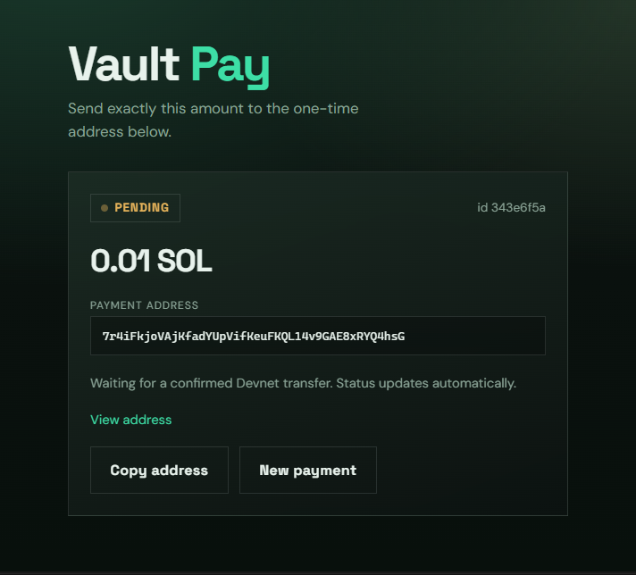

Solana vault program (Anchor) plus a Node.js **one-time payment** app for Devnet.

## Parts of this repo

| Path | What it is |
|------|------------|
| `programs/vault` | On-chain Anchor vault: initialize / deposit / withdraw |
| `app/` | Backend + frontend: Pay button → unique Solana address → payment tracking |

---

## One-time payments app (`app/`)

Click **Pay** in the browser, get a fresh Devnet address, send SOL, and the backend marks the payment as paid when funds arrive.

### Stack

- **Backend:** Express + `@solana/web3.js` + JSON store + balance watcher
- **Frontend:** React + TypeScript
- **Cluster:** Solana Devnet

### Run

```bash
# terminal 1 — API
cd app/backend
cp .env.example .env
echo "MERCHANT_ADDRESS={YOUR_ADDRESS}" >> .env
npm install
npm run dev

# terminal 2 — React UI build
cd app/frontend
npm install
npm run build
```

Open **http://localhost:3001**



1. Enter an amount (default `0.01` SOL)
2. Click **Pay**
3. Send that amount from any Devnet wallet to the shown address
4. Status updates to `settling` when the watcher sees enough lamports
5. Status updates to `settled` when funds transferred to MERCHANT_ADDRESS

### How it works

1. Backend generates a new Solana keypair per payment
2. Public address is returned to the browser (secret key is never exposed in the API)
3. Watcher polls Devnet every few seconds
4. When balance ≥ expected amount → status `settling`, create transfer TX to merchant
5. Transfer transaction is created for requested amount or the balance - transaction fee, whichever is smaller
6. Unpaid addresses expire after 30 minutes (`PAYMENT_TTL_MS`)

### API

| Method | Path | Description |
|--------|------|-------------|
| `POST` | `/api/payments` | Create one-time address. Body: `{ "amountSol": 0.01 }` |
| `GET` | `/api/payments/:id` | Payment status |
| `GET` | `/api/payments` | List payments |
| `GET` | `/api/health` | Health + RPC info |

### App layout

```
app/
├── TAKE_HOME.md
├── backend/
│   ├── src/
│   │   ├── index.ts
│   │   ├── payments.ts
│   │   ├── solana.ts
│   │   ├── watcher.ts
│   │   ├── store.ts
│   │   └── types.ts
│   └── package.json
└── frontend/
    ├── public/index.html
    ├── package.json
    └── src/
        ├── main.tsx
        ├── App.tsx
        ├── api.ts
        └── index.css
```

### Candidate take-home

Brief: [`app/TAKE_HOME.md`](app/TAKE_HOME.md)  

Candidates get this `app/` as a **starter** (create address + track payment already works).  
Their task is the **unimplemented** part: **settle/sweep** paid SOL from the one-time address to a merchant wallet.

### Notes

- Get Devnet SOL from a faucet before paying
- Secret keys are stored in `app/backend/data/payments.json` for this demo only — use a KMS/HSM in production
- This app is separate from the on-chain vault; it does not call the Anchor program

---

## On-chain vault (`programs/vault`)

A simple Solana vault built with Anchor 1.0. Users deposit SOL into a vault and withdraw later. Only the person who created the vault can withdraw.

### Instructions

1. **Initialize** — Creates two PDAs: one for ownership state, one that holds SOL
2. **Deposit** — Sends SOL from the user wallet into the vault
3. **Withdraw** — Moves SOL from the vault back to the owner

### Why two accounts?

- `vault_state` — Stores the owner (authority) and bump seeds
- `vault` — Holds deposited SOL

Accounts that hold data and accounts that hold SOL are managed differently on Solana, so keeping them separate keeps the program cleaner.

### Tech stack

- Anchor 1.0.2
- Rust
- LiteSVM for testing

### Vault layout

```
programs/vault/src/
├── lib.rs
├── instructions/
│   ├── initialize.rs
│   ├── deposit.rs
│   └── withdraw.rs
├── state.rs
├── constants.rs
├── error.rs
└── instructions.rs
programs/vault/tests/
└── test_initialize.rs
```

### Build

Requires Rust, Solana CLI, and Anchor:

```bash
anchor build
```

Output: `target/deploy/vault.so`

### Test

```bash
cargo test
```

Expected:

```
running 5 tests
test test_initialize ... ok
test test_deposit ... ok
test test_withdraw ... ok
test test_withdraw_unauthorized_fails ... ok
test test_vault_flow ... ok

test result: ok. 5 passed; 0 failed
```

| Test | What it checks |
|------|----------------|
| `test_initialize` | Vault PDAs get created correctly |
| `test_deposit` | SOL moves from user to vault |
| `test_withdraw` | SOL moves from vault back to owner |
| `test_withdraw_unauthorized_fails` | Random users cannot withdraw |
| `test_vault_flow` | Full workflow end to end |

### Design notes

- **Deposit** uses a CPI to the System Program (user wallet → vault)
- **Withdraw** adjusts lamports directly because the vault is a program-owned PDA
- **Authority** is enforced with Anchor’s `has_one = authority`

### Security

- Only the vault creator can withdraw
- PDA seeds are validated on every instruction
- All state changes require a transaction signer

## License

MIT
